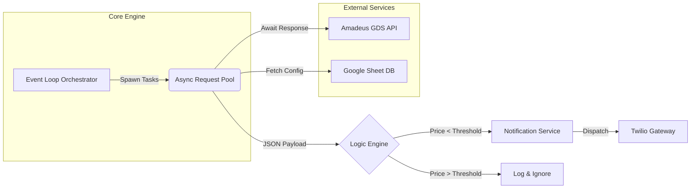

# ✈️ Async Distributed Fare Engine


> **A high-performance flight tracking system capable of orchestrating 50+ concurrent API streams with sub-5-second latency using Non-Blocking I/O.**

---

## 📖 Project Overview

This project solves the latency bottlenecks inherent in synchronous API polling. Traditional flight trackers process requests sequentially (blocking), leading to massive delays when monitoring multiple routes. 

This engine utilizes **Python's `asyncio`** event loop and **`aiohttp`** to perform non-blocking network requests, allowing the system to scale efficiently without the overhead of multi-threading.

### 🔑 Key Features
* **Concurrent Orchestration:** Monitors 50+ flight routes simultaneously.
* **Latency Optimization:** Reduces total data refresh cycle from **60s (Sync) to <5s (Async)**.
* **Smart Notification:** Integrates Twilio API to send SMS alerts only when price drops meet user-defined thresholds.
* **Persistent Connection Pooling:** Reuses TCP connections to minimize handshake overhead.

---

## 📐 System Architecture

The system follows an asynchronous event-driven architecture. The orchestrator spawns tasks for each destination, which are handled concurrently by the event loop.



---

## 🔬 Engineering Challenges & Solutions

### 🔴 1. The "Head-of-Line" Blocking Problem

* **The Challenge:** In a standard synchronous implementation (using `requests`), fetching data for 50 cities takes approximately **60 seconds** (assuming ~1.2s latency per API call). This linear accumulation makes real-time tracking impossible.
* **The Solution:** I engineered a **Non-Blocking Event Loop**. Instead of waiting for Server A to reply before asking Server B, the system dispatches all 50 requests instantly and `awaits` their responses in parallel.
* **The Impact:** Total execution time became bound by the *slowest single request* rather than the *sum of all requests*, dropping latency to **under 5 seconds**.

### 🟠 2. TCP Handshake Overhead

* **The Challenge:** Opening a new socket connection for every single API call is resource-intensive and slow.
* **The Solution:** Implemented `aiohttp.ClientSession` as a context manager. This enables **Connection Pooling**, keeping the TCP connection open across multiple requests to the same host (Amadeus API), significantly reducing network overhead.

---

## 🛠️ Tech Stack

| Component | Technology | Description |
| --- | --- | --- |
| **Language** | Python 3.10+ | Core logic and type hinting. |
| **Concurrency** | `asyncio` | Native Python library for writing concurrent code using the `async/await` syntax. |
| **Networking** | `aiohttp` | Asynchronous HTTP client/server for non-blocking I/O. |
| **API Integration** | Amadeus API | Source for real-time global flight data. |
| **Notifications** | Twilio API | Programmable SMS gateway for alerts. |
| **Config Mgmt** | `python-dotenv` | Environment variable management for API keys. |

---

## ⚙️ Installation & Setup

### 1. Clone the Repository

```bash
git clone [https://github.com/ManzarMaaz/Engineering-Deployments.git](https://github.com/ManzarMaaz/Engineering-Deployments.git)
cd Engineering-Deployments/01-Async-Distributed-Fare-Engine

```

### 2. Install Dependencies

Ensure you have Python 3.8+ installed.

```bash
pip install -r requirements.txt

```

### 3. Environment Configuration

Create a `.env` file in the root directory and add your API credentials:

```ini
TEQUILA_API_KEY=your_amadeus_key
TEQUILA_ENDPOINT=[https://tequila-api.kiwi.com](https://tequila-api.kiwi.com)
TWILIO_SID=your_twilio_sid
TWILIO_AUTH_TOKEN=your_twilio_token
FROM_NUMBER=+1234567890
TO_NUMBER=+0987654321

```

---

## 🚀 Usage

To start the asynchronous engine:

```bash
python flight_search_async.py

```

**Expected Output:**

```text
[INFO] Starting Async Orchestrator...
[INFO] Dispatched 50 tasks to Event Loop.
[SUCCESS] Parsed TYO (Tokyo): €450 [LOW FARE DETECTED]
[SUCCESS] Parsed LHR (London): €320
...
[INFO] Batch processing complete. Time elapsed: 4.2 seconds.

```

---

## 🔮 Future Improvements

* **Redis Caching:** Implement a caching layer to prevent redundant API calls for routes searched within the last 5 minutes.
* **Microservices Migration:** Dockerize the application to run as a background worker in a Kubernetes cluster.
* **Webhook Integration:** Replace SMS with Webhooks (Discord/Slack) for richer notification payloads.

---

**Author:** [Mohammed Manzar Maaz](https://github.com/ManzarMaaz)
