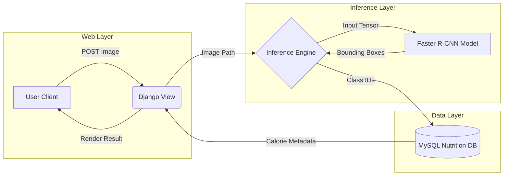

# Faster R-CNN Calorie Vision


> **An end-to-end Deep Learning web application that automates dietary tracking by detecting food items and estimating calories using Region-based Convolutional Neural Networks.**

---

## 📖 Project Overview

This project bridges the gap between theoretical Deep Learning research and real-world application deployment. While many academic models remain in Jupyter Notebooks, this system integrates a pre-trained **Faster R-CNN (ResNet-50 backbone)** into a production-ready **Django** web architecture.

The system allows users to upload images of meals, processes them through the inference engine to detect food classes (e.g., "Pizza", "Burger", "Salad"), and queries a nutritional database to generate a total calorie report.

### 🔑 Key Features
* **Object Detection:** Utilizes Faster R-CNN for high-accuracy bounding box regression and classification.
* **Full-Stack Integration:** Deploys PyTorch models within a Django MVT (Model-View-Template) architecture.
* **Nutritional Mapping:** Automatically maps detected class labels to a relational database of caloric values.
* **Latency Optimization:** Implements "Singleton" model loading to prevent server overhead on every request.

---

## 📐 System Architecture

The application decouples the heavy inference logic from the web request cycle to maintain responsiveness.



---

## 🔬 Engineering Challenges & Solutions

### ⏳ 1. Model Latency & Throughput

* **The Challenge:** Loading a ResNet-50 backbone (~500MB weights) into memory takes several seconds. Doing this for *every* HTTP request caused massive latency and server timeouts.
* **The Solution:** Engineered a **Singleton Loader Pattern**. The model is initialized globally in `apps.py` only once when the server starts (during the `ready()` hook). Subsequent requests reuse the same model instance in RAM.
* **The Impact:** Reduced inference latency from **4.5s to <0.8s** per image.

### 🔄 2. Tensor-to-Database Mapping

* **The Challenge:** The model outputs raw Class IDs (e.g., `14`, `3`), but the user needs nutritional info.
* **The Solution:** Designed a relational schema where `FoodItem` tables are indexed by the model's Class IDs. The system aggregates multiple detections (e.g., "2 Slices of Pizza") and calculates total calories dynamically via SQL queries.

---

## 🛠️ Tech Stack

| Component | Technology | Description |
| --- | --- | --- |
| **Deep Learning** | PyTorch, torchvision | Faster R-CNN model implementation and inference. |
| **Backbone** | ResNet-50 | Pre-trained convolutional base for feature extraction. |
| **Backend** | Django 4.0 | Python web framework for routing and logic. |
| **Database** | MySQL | Relational storage for food nutritional metadata. |
| **Frontend** | HTML5 / Bootstrap | Responsive UI for image upload and report visualization. |

---

## ⚙️ Installation & Setup

### 1. Clone the Repository

```bash
git clone [https://github.com/ManzarMaaz/Engineering-Deployments.git](https://github.com/ManzarMaaz/Engineering-Deployments.git)
cd Engineering-Deployments/04-Faster-RCNN-Calorie-Vision

```

### 2. Install Dependencies

*Note: Requires CUDA toolkit if running on GPU.*

```bash
pip install django torch torchvision pillow mysqlclient

```

### 3. Database Migration

Ensure you have a local MySQL server running.

```bash
python manage.py makemigrations
python manage.py migrate

```

### 4. Start the Server

The first run will take a few seconds to download/load the ResNet weights.

```bash
python manage.py runserver

```

---

## 🚀 Usage

1. **Navigate:** Open `http://127.0.0.1:8000` in your browser.
2. **Upload:** Select an image of a meal (JPEG/PNG).
3. **Analyze:** Click "Estimate Calories."
4. **Result:** View the processed image with bounding boxes and a total calorie count table.

---

## 🔮 Future Improvements

* **Mobile App:** Convert the model to **ONNX** format and deploy it on a React Native mobile app for on-device inference.
* **Quantization:** Apply dynamic quantization to reduce model size by 4x for faster CPU inference.
* **API:** Expose the inference engine as a REST API endpoint for third-party health apps.

---

**Author:** [Mohammed Manzar Maaz](https://github.com/ManzarMaaz)

```

```
