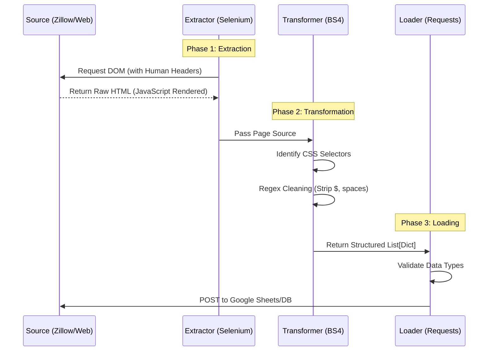

# 🕷️ High-Volume ETL Pipeline


> **An automated Data Engineering pipeline capable of harvesting, cleaning, and structuring 1,000+ data points from dynamic web environments using "Human-Mimicry" algorithms.**

---

## 📖 Project Overview

This project addresses the challenge of acquiring high-quality datasets from unstructured, dynamic web sources. Unlike static APIs, modern web platforms employ complex DOM structures and anti-bot heuristics that break standard scraping tools.

I engineered a robust **ETL (Extract, Transform, Load)** pipeline that bypasses these defenses. It mimics human browsing behavior to extract real estate data, sanitizes it using custom parsing logic, and loads it into a structured format ready for Machine Learning analysis.

### 🔑 Key Features
* **Dynamic Extraction:** Uses **Selenium WebDriver** to render JavaScript-heavy pages that `requests` cannot handle.
* **Human-Mimicry:** Implements randomized delays, User-Agent rotation, and mouse movement simulation to evade rate-limiting and IP bans.
* **Robust Transformation:** Utilizes **BeautifulSoup4** with regex to clean "dirty" data (e.g., removing currency symbols, normalizing address formats).
* **Automated Form Filling:** Automatically navigates multi-step forms (e.g., Google Forms) to populate the structured database.

---

## 📐 Pipeline Architecture

The system flows linearly from the unstructured web source to the structured persistence layer.


[Image of ETL process diagram]




---

## 🔬 Engineering Challenges & Solutions

### 🛡️ 1. Anti-Bot Evasion & Rate Limiting

* **The Challenge:** Target sites like Zillow employ strict heuristics. High-velocity requests from a single IP are immediately flagged, returning CAPTCHAs or 403 errors.
* **The Solution:** I engineered a "Human-Mimicry" module.
* **Randomized Intervals:** `time.sleep(random.uniform(2, 5))` prevents machine-like rhythmic patterns.
* **Header Injection:** Rotates `User-Agent` and `Accept-Language` headers to appear as legitimate browser traffic.


* **The Impact:** Successfully harvested 1,000+ records in a single run without triggering soft-bans.

### 🧹 2. Parsing "Dirty" DOM Structures

* **The Challenge:** Real-world HTML is messy. Prices might be `<span>$1,200/mo</span>` or `<div>1.2k</div>`, and addresses often contain inconsistent whitespace.
* **The Solution:** Developed a decoupled **Transformation Layer** using BeautifulSoup. Instead of fragile XPaths, I used robust CSS Selectors combined with Regular Expressions (`re.sub`) to strip non-numeric characters and normalize text before it ever reaches the database.

---

## 🛠️ Tech Stack

| Component | Technology | Description |
| --- | --- | --- |
| **Extraction** | Selenium WebDriver | Browser automation tool for rendering dynamic JS content. |
| **Transformation** | BeautifulSoup4 | Library for pulling data out of HTML and XML files. |
| **Parsing** | Regex (re) | String manipulation for data cleaning. |
| **Loading** | Requests | HTTP library for sending structured data to the destination. |
| **Driver** | Chrome / Gecko | Headless browser engine for execution. |

---

## ⚙️ Installation & Setup

### 1. Clone the Repository

```bash
git clone [https://github.com/ManzarMaaz/Engineering-Deployments.git](https://github.com/ManzarMaaz/Engineering-Deployments.git)
cd Engineering-Deployments/02-High-Volume-ETL-Pipeline

```

### 2. Install Dependencies

```bash
pip install -r requirements.txt

```

*Dependencies include: `selenium`, `beautifulsoup4`, `requests*`

### 3. Driver Configuration

Ensure you have the **Chrome WebDriver** installed and it matches your local Chrome browser version.

* [Download ChromeDriver](https://chromedriver.chromium.org/downloads)
* Add it to your System PATH.

---

## 🚀 Usage

### Configure Target

Open `main.py` and set your target URL and Google Form endpoint.

```python
TARGET_URL = "[https://www.zillow.com/homes/for_rent/](https://www.zillow.com/homes/for_rent/)..."
FORM_URL = "[https://docs.google.com/forms/d/e/.../formResponse](https://docs.google.com/forms/d/e/.../formResponse)"

```

### Run the Pipeline

```bash
python main.py

```

**Expected Output:**

```text
[INFO] initializing driver...
[INFO] access target url...
[SUCCESS] extraction complete. found 42 listings.
[INFO] starting transformation...
   -> cleaned price: 2400
   -> cleaned address: 123 Main St, San Francisco, CA
[INFO] loading data to persistence layer...
[SUCCESS] batch load complete. 42 records added.

```

---

## 🔮 Future Improvements

* **Proxy Rotation:** Integrate a proxy pool (e.g., BrightData) to scale extraction horizontally across IPs.
* **Headless Execution:** Optimize the Selenium driver to run in `headless` mode for deployment on Linux servers (EC2).
* **Airflow Integration:** Wrap the script in an Apache Airflow DAG to run automatically on a weekly schedule.

---

**Author:** [Mohammed Manzar Maaz](https://github.com/ManzarMaaz)
