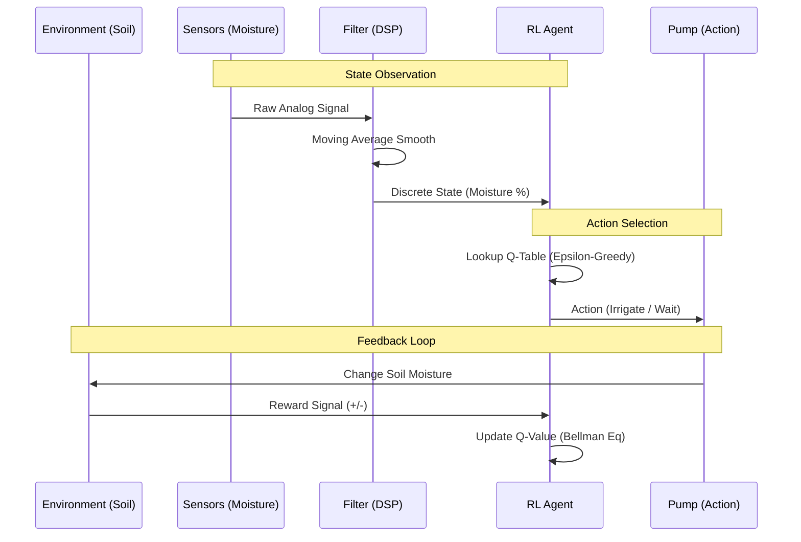

# 💧 RL Smart Irrigation System


> **An autonomous agricultural agent that utilizes Q-Learning to optimize water resource allocation, reducing waste while maintaining optimal soil homeostasis.**

---

## 📖 Project Overview

Traditional irrigation systems rely on static timers, which often lead to over-watering (waste) or under-watering (crop damage) depending on weather conditions. 

This project implements a **Reinforcement Learning (RL)** agent that learns the optimal irrigation strategy dynamically. By interacting with an environment of soil moisture sensors, the agent balances the immediate "cost" of pumping water against the long-term "reward" of plant health, achieving a resource-efficient equilibrium without human intervention.

### 🔑 Key Features
* **Autonomous Decision Making:** The agent decides *when* and *how much* to water based on real-time soil state, not a clock.
* **Q-Learning Algorithm:** Implements Tabular Q-Learning (Off-policy TD control) to converge on an optimal policy.
* **Noise Filtration:** Includes a signal processing layer to handle noisy analog sensor data from real-world hardware.
* **Reward Shaping:** Solves the "Sparse Reward" problem common in agricultural AI by defining immediate feedback loops.

---

## 📐 System Architecture

The system models the classic RL Agent-Environment interaction loop.



---

## 🔬 Engineering Challenges & Solutions

### 📉 1. The "Sparse Reward" Problem

* **The Challenge:** In agriculture, the ultimate reward (a harvested crop) happens weeks or months later. If an RL agent only receives a reward at the end, it takes millions of episodes to learn.
* **The Solution:** I designed a **Shaped Reward Function**.
* **Homeostasis Reward:** The agent receives a positive micro-reward (`+1`) for every timestep the soil moisture stays within the target range (40% - 60%).
* **Waste Penalty:** It receives a negative reward (`-0.5`) for watering when moisture is already adequate.


* **The Impact:** The agent converges on an optimal policy 10x faster than with sparse terminal rewards.

### 🔊 2. Analog Sensor Noise

* **The Challenge:** Low-cost resistive soil moisture sensors produce noisy data spikes (jitter) which can trick the agent into thinking the soil is dry.
* **The Solution:** Implemented a **Digital Signal Processing (DSP)** layer using a Moving Average Filter (Window Size = 10).
* `Smooth_Reading = (S[t] + S[t-1] ... + S[t-9]) / 10`


* **The Impact:** Prevents "false positive" irrigation actions triggered by electrical noise.

---

## 🛠️ Tech Stack

| Component | Technology | Description |
| --- | --- | --- |
| **Language** | Python 3.8 | Logic and simulation. |
| **Algorithm** | Q-Learning | Tabular Reinforcement Learning implementation. |
| **Math** | NumPy | Matrix operations for the Q-Table updates. |
| **Hardware** | Arduino / ESP32 | (Optional) Microcontroller interface for physical sensors. |
| **Simulation** | Gym-like Wrapper | Custom environment class simulating soil drying rates. |

---

## ⚙️ Installation & Simulation

### 1. Clone the Repository

```bash
git clone [https://github.com/ManzarMaaz/Engineering-Deployments.git](https://github.com/ManzarMaaz/Engineering-Deployments.git)
cd Engineering-Deployments/05-RL-Smart-Irrigation-System

```

### 2. Install Dependencies

```bash
pip install numpy matplotlib

```

### 3. Run the Training Loop

Execute the script to train the agent in the simulated environment.

```bash
python train_agent.py

```

**Expected Output:**

```text
[Episode 0] Total Reward: -50 (Exploring...)
[Episode 100] Total Reward: -10 (Learning...)
[Episode 500] Total Reward: +200 (Converged!)
> Optimal Policy generated.
> Saving Q-Table to 'policy.npy'

```

---

## 🔮 Future Improvements

* **Deep Q-Network (DQN):** Replace the tabular approach with a Neural Network to handle continuous state spaces (e.g., combining temperature + humidity + soil moisture).
* **Weather Integration:** Incorporate API data (OpenWeatherMap) to prevent watering if rain is forecast.
* **Hardware Deployment:** Port the trained policy to a Raspberry Pi Zero for field testing.

---

**Author:** [Mohammed Manzar Maaz](https://github.com/ManzarMaaz)
