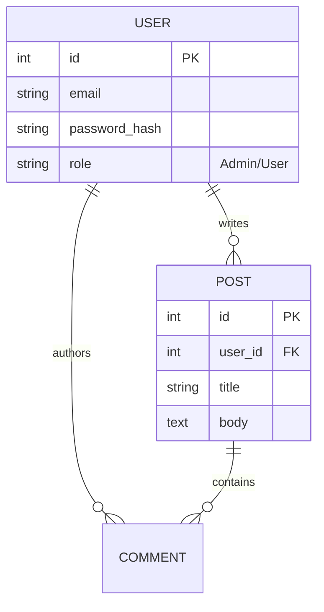

# 🔐 Secure RBAC Content Management System


> **A secure, monolithic web application featuring Role-Based Access Control (RBAC), cryptographic password hashing, and persistent relational data storage.**

---

## 📖 Project Overview

This project was engineered to solve the security vulnerabilities common in basic CRUD applications, specifically **Privilege Escalation** and **Insecure Direct Object References (IDOR)**.

Instead of a simple blog, this is a **security-first CMS** where user permissions are strictly enforced by the backend. It features a dual-role system (`Admin` vs. `User`) where route access is guarded by custom Python decorators, ensuring that users can only modify resources they explicitly own.

### 🔑 Key Features
* **Role-Based Access Control (RBAC):** Admin users have global CRUD privileges; standard users are restricted to read-only access for public posts and write access *only* for their own comments.
* **Cryptographic Security:** Passwords are never stored in plain text. The system uses **Werkzeug's** PBKDF2-SHA256 hashing with salt to secure credentials.
* **Session Management:** Utilizes `Flask-Login` for secure session handling, protecting against session hijacking.
* **Relational Integrity:** Implements One-to-Many relationships (Users $\to$ Posts $\to$ Comments) using SQLAlchemy.

---

## 📐 System Architecture

The application follows the **Model-View-Controller (MVC)** pattern (adapted for Flask as MVT).




---

## 🔬 Engineering Challenges & Solutions

### 🛡️ 1. Preventing Horizontal Privilege Escalation

* **The Challenge:** In many web apps, changing a URL ID (e.g., `/edit-post/42`) allows a user to edit someone else's content.
* **The Solution:** I implemented a custom **`@admin_only` decorator**. This wrapper function intercepts the request *before* it reaches the view function, checks the `current_user`'s role attribute, and aborts with a `403 Forbidden` error if the criteria aren't met.
* **The Impact:** Zero unauthorized edits or deletions are possible, regardless of UI exposure.

### 🔑 2. Secure Authentication Flow

* **The Challenge:** Building a login system from scratch often leads to vulnerabilities like SQL Injection or weak hashing.
* **The Solution:** Integrated **Werkzeug security helpers**.
* **Registration:** `generate_password_hash(password, method='pbkdf2:sha256', salt_length=8)`
* **Login:** `check_password_hash(stored_hash, input_password)`


* **The Impact:** Even if the database is compromised, user passwords remain computationally infeasible to reverse.

---

## 🛠️ Tech Stack

| Component | Technology | Description |
| --- | --- | --- |
| **Backend** | Flask (Python) | Lightweight WSGI web application framework. |
| **Database** | SQLite / PostgreSQL | Relational database management. |
| **ORM** | SQLAlchemy | Object Relational Mapper for database abstraction. |
| **Security** | Werkzeug | Library for hashing and password verification. |
| **Sessions** | Flask-Login | User session management and cookie handling. |
| **Frontend** | Jinja2 + Bootstrap | Server-side templating for dynamic HTML generation. |
| **Forms** | Flask-WTF | Form handling and CSRF protection. |

---

## ⚙️ Installation & Setup

### 1. Clone the Repository

```bash
git clone [https://github.com/ManzarMaaz/Engineering-Deployments.git](https://github.com/ManzarMaaz/Engineering-Deployments.git)
cd Engineering-Deployments/03-Secure-RBAC-CMS

```

### 2. Install Dependencies

```bash
pip install -r requirements.txt

```

### 3. Initialize the Database

The app uses `app.app_context()` to create the initial DB tables.

```bash
python
>>> from main import db, app
>>> with app.app_context():
...     db.create_all()
>>> exit()

```

### 4. Run the Server

```bash
python main.py

```

*Access the application at `http://127.0.0.1:5000*`

---

## 🚀 Usage Guide

### Creating an Admin User

By default, the first user created is often manually set to Admin, or you can manipulate the DB directly for testing:

1. Register a new user via the `/register` route.
2. The system assigns a default `id`.
3. Use the `@admin_only` decorated routes to test access control.

### Testing Security

* **Try to Edit:** Log in as a standard user and attempt to visit `/edit-post/1`.
* **Expected Result:** The server returns a **403 Forbidden** page, proving the RBAC middleware is active.

---

## 🔮 Future Improvements

* **Two-Factor Authentication (2FA):** Integrate TOTP (Time-based One-Time Password) for admin accounts.
* **API Migration:** Refactor the backend to serve a REST API (using Flask-RESTful) and build a separate React frontend.
* **Dockerization:** Containerize the application and database for easy deployment.

---

**Author:** [Mohammed Manzar Maaz](https://github.com/ManzarMaaz)
